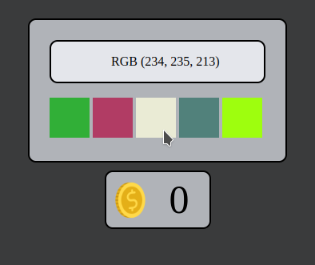

#GUESS THE COLORS
##Como Jogar
Um jogo de cores do qual o jogador tem o objetivo de tentar adivinhar uma cor gerada aleatoriamente, dentre as 5 opções apresentadas logo abaixo o visor do game (do qual indica o RGB da cor que deve ser selecionada) o jogador deve escolher a que representa exatamente a combinação.
Ao iniciar o game será gerada as 5 cores aleatórias e a "chave RGB", clique em uma das cores abaixo do visor para verificar se a cor confere. Caso tiver acertado, irá receber 3 moedas e aparecerá novas cores, caso contrário, perderá 2 moedas e precisará clicar novamente em uma das outras cores, até encontrar a cor certa. O Objetivo do jogo é acumular o máximo de moedas.
##Como Executar
Para acessar o jogo é necessário abrir o arquivo "index.html" pelo seu browser.

